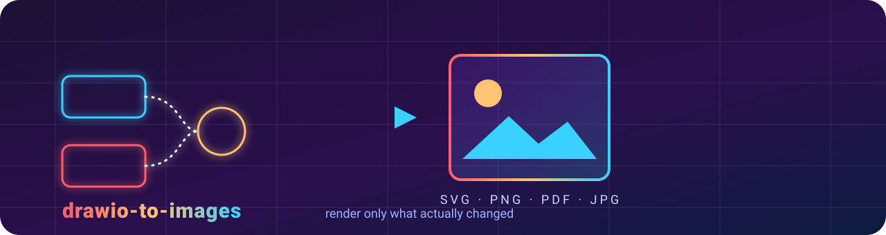
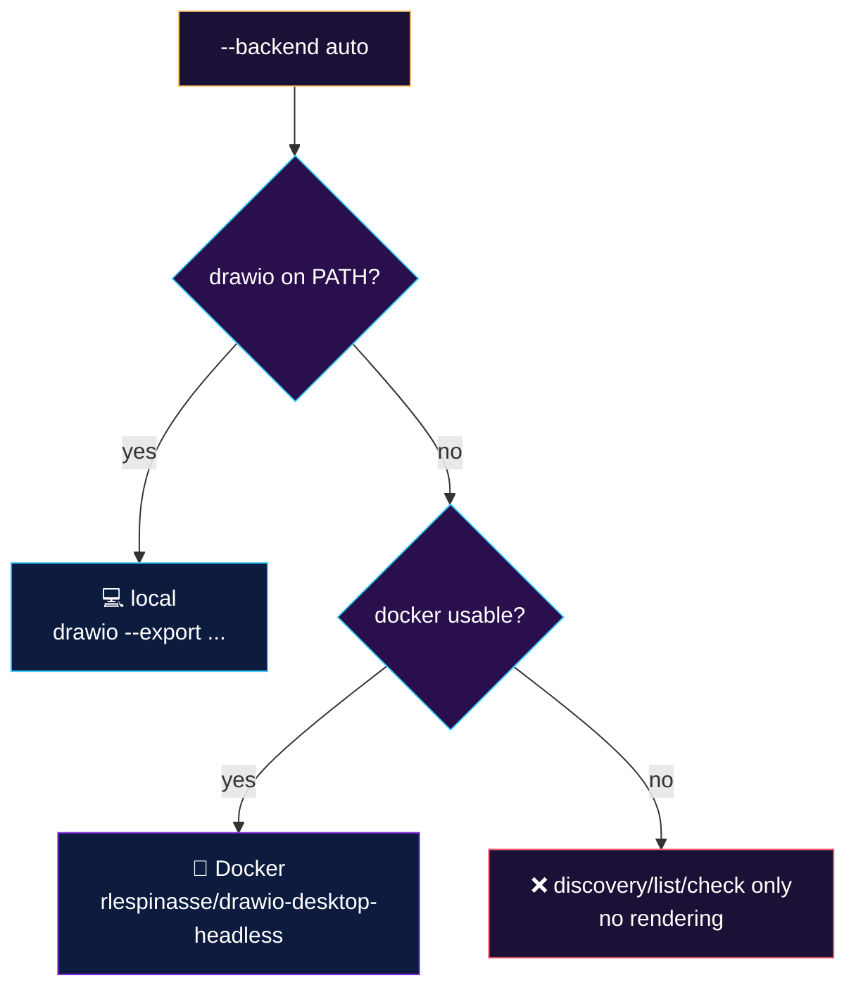
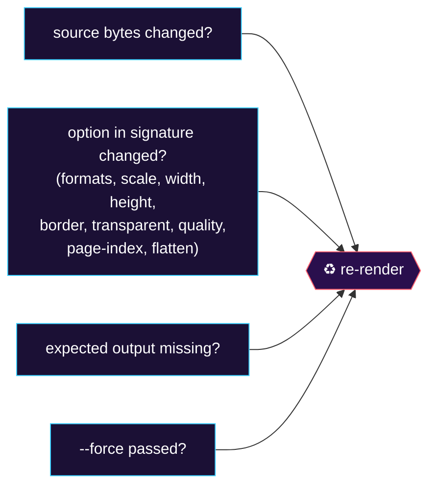
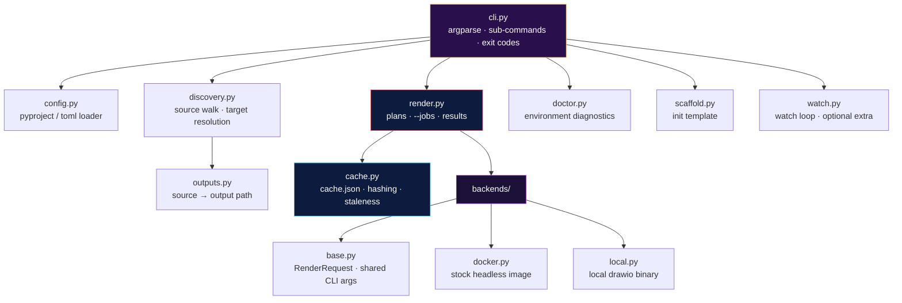

<div align="center">



<h1>🎨 drawio-to-images</h1>

<b>A tiny <code>uvx</code>-installable CLI that turns <code>.drawio</code> files into images —<br>
and re-renders a diagram <i>only</i> when its source (or the render options) actually changed.</b>

<br><br>

<!-- badges: yes, these are images. loads of them. -->
[](#-license)
[](https://www.python.org/)
[](https://docs.astral.sh/uv/)
[](#-backends)

[](https://www.drawio.com/)
[](#-ci-friendly)
[](#-installation)
[](#-roadmap)

<h4>Renders to &nbsp;→</h4>


</div>

```bash
uvx --from git+https://github.com/mshajarrazip/drawio-to-images drawio-export
```

<sub>Install it once, run <code>drawio-export</code> in any project. Rendering is delegated to a headless
<code>drawio-desktop</code> — in Docker (nothing to install beyond Docker) or a local <code>drawio</code> binary if you have one.</sub>


## 🗺️ Contents

| | | |
|---|---|---|
| [✨ What it does](#-what-it-does) | [⚙️ How it works](#️-how-it-works) | [📦 Requirements](#-requirements) |
| [🚀 Installation](#-installation) | [⚡ Quick start](#-quick-start) | [🎛️ Usage](#️-usage) |
| [🧾 Commands](#-commands) | [🔩 Options](#-options) | [🛠️ Configuration](#️-configuration) |
| [🐳 Backends](#-backends) | [🧠 Change tracking](#-change-tracking) | [🌳 Output layout](#-output-layout) |
| [🚧 Limits & caveats](#-limits--caveats) | [🧑‍💻 Development](#-development) | [🧭 Roadmap](#-roadmap) |


## ✨ What it does

- 🔍 **Walks a source directory** for `*.drawio` files (default `diagrams/`, or `.` if there is no `diagrams/`).
- 🪞 **Mirrors the tree** — renders each one to `imgs/<same relative path>.<ext>`, sub-directories and all.
- 🎯 **Flexible targets** — a bare label (`data-intake-flow`), a path under the source dir (`sub/dir/foo`), or a
  full path (`diagrams/data-intake-flow.drawio`) — with or without the `.drawio` suffix. An unknown target fails
  and lists what *is* available.
- 🧠 **Skips unchanged diagrams.** A per-project `sha256` cache records each source's hash and the render options
  used; a diagram is re-rendered only if the source changed, an option changed, an output is missing, or
  `--force` is given.
- 🎨 **Many formats at once** — `--format svg,png` plus `--scale`, `--width`, `--height`, `--border`,
  `--transparent` (PNG), `--quality` (JPG) and `--page-index`.
- 🧵 **Parallel** — runs diagrams concurrently with `--jobs`.
- 🤖 **`check` mode for CI** — report anything stale and exit non-zero, without rendering.
- 🩺 **Batteries** — `doctor` diagnoses the environment, `init` drops a config file, `list` inspects status,
  `prune` deletes orphaned outputs.


## ⚙️ How it works

```mermaid
flowchart LR
    A[📁 diagrams/**.drawio] --> B{🧠 cache<br/>sha256 + options}
    B -- unchanged --> S[⏭️ skip]
    B -- changed / missing / --force --> C[🎬 render plan]
    C --> D{{🐳 Docker  ·  💻 local drawio}}
    D --> E[🖼️ imgs/**.svg .png .pdf .jpg]
    E --> F[💾 update cache.json]

    style A fill:#2a0f4d,stroke:#3ad0ff,color:#fff
    style B fill:#1b1035,stroke:#ffc371,color:#fff
    style S fill:#0d1b3f,stroke:#9fb2ff,color:#fff
    style C fill:#1b1035,stroke:#ff5f6d,color:#fff
    style D fill:#2a0f4d,stroke:#8a2be2,color:#fff
    style E fill:#0d1b3f,stroke:#3ad0ff,color:#fff
    style F fill:#1b1035,stroke:#ffc371,color:#fff
```


## 📦 Requirements

| Requirement | Notes |
|---|---|
| 🧰 **[`uv`](https://docs.astral.sh/uv/getting-started/installation/)** (provides `uvx`) | The only thing you install by hand. |
| 🐍 **Python ≥ 3.11** | `uv` fetches a suitable interpreter automatically; nothing to do. |
| 🎬 **A rendering backend** — *one of the two below* | Required at render time. Without either, `doctor`, `list` and `check` still work; actual rendering does not. |
| &nbsp;&nbsp;🐳 **Docker** (default) | Engine + a running daemon on Linux, or Docker Desktop on macOS/Windows. Your user must be able to run `docker` (the `docker` group, or Docker Desktop). The first render pulls **`rlespinasse/drawio-desktop-headless:v1.61.0`** (~1 GB, cached thereafter). On Linux the CLI passes `--user $(id -u):$(id -g)` so outputs are owned by you, not root. |
| &nbsp;&nbsp;💻 **A local `drawio` binary** | Anything named `drawio` (or `draw.io`) on `PATH` — the Linux AppImage/`.deb`, the macOS app's CLI, etc. On headless Linux (no `DISPLAY`) you also need **`xvfb`** (`xvfb-run`); the CLI wraps the call automatically when it is present. |
| 🪝 **`pre-commit`** | Only if you wire the bundled hook into `.pre-commit-config.yaml`. |
| 👀 The **`watch`** extra | Only for `drawio-export watch`; pulls in `watchfiles`. |

> 💡 Run `drawio-export doctor` to see exactly which backends are usable on your machine.


## 🚀 Installation

<table>
<tr><td>

**🥡 One-off, no install**

```bash
uvx --from git+https://github.com/mshajarrazip/drawio-to-images drawio-export --help
```

</td></tr>
<tr><td>

**📌 Pinned to a tag** — do this in CI, for reproducible output

```bash
uvx --from git+https://github.com/mshajarrazip/drawio-to-images@v0.1.0 drawio-export check
```

</td></tr>
<tr><td>

**🔗 Persistent install** — puts `drawio-export` on your `PATH`

```bash
uv tool install git+https://github.com/mshajarrazip/drawio-to-images
drawio-export --version
```

</td></tr>
<tr><td>

**👀 With the watch extra**

```bash
uv tool install "drawio-to-images[watch] @ git+https://github.com/mshajarrazip/drawio-to-images"
```

</td></tr>
</table>

**🧩 As a project's dev dependency** (`pyproject.toml`)

```toml
[dependency-groups]
dev = ["drawio-to-images @ git+https://github.com/mshajarrazip/drawio-to-images@v0.1.0"]
```

then `uv run drawio-export`.

**🪝 As a pre-commit hook** (`.pre-commit-config.yaml`)

```yaml
repos:
  - repo: https://github.com/mshajarrazip/drawio-to-images
    rev: v0.1.0
    hooks:
      - id: drawio-export         # render changed diagrams
      # - id: drawio-export-check # or: just fail if an image is stale
```


## ⚡ Quick start

```bash
cd my-project
drawio-export init            # optional: write drawio-export.toml
drawio-export                 # render every changed diagram under diagrams/ -> imgs/*.svg
```


## 🎛️ Usage

```bash
# Render every changed diagram (diagrams/ -> imgs/, SVG)
drawio-export

# One diagram, by bare label
drawio-export data-intake-flow

# Several, by name
drawio-export schema data-intake-flow

# Re-render even if nothing changed
drawio-export --force data-intake-flow
drawio-export --force

# PNG + SVG at 2x
drawio-export --format png,svg --scale 2

# A different layout
drawio-export --src docs/diagrams --out docs/assets --format pdf

# One specific file to one specific path
drawio-export path/to/one.drawio -o build/one.png

# CI: non-zero exit if any committed image is out of date (renders nothing)
drawio-export check

# What would run?
drawio-export --dry-run

# Diagnose the environment
drawio-export doctor
```

### 🧾 Commands

| Command | Purpose |
|---|---|
| 🎬 `render` *(default)* | Render targeted diagrams; skips unchanged ones unless `--force`. |
| 🤖 `check` | Print `ok` / `stale` per diagram; exit `1` if anything is stale or missing. No rendering. |
| 📋 `list` | Every discovered diagram with its `fresh` / `stale` status. |
| 🧹 `prune` | Delete files in `--out` (of the configured formats) that no longer have a source. `--dry-run` to preview. |
| 👀 `watch` | Render, then re-render on any `.drawio` change. Needs the `watch` extra. |
| 🩺 `doctor` | Report Docker / local-`drawio` / `xvfb` availability and which backend `auto` picks. |
| 🌱 `init` | Write a starter `drawio-export.toml` (`--force` to overwrite). |

### 🔩 Options

`render`, `check`, `watch`:

```
  --src DIR                source root (default: ./diagrams if present, else .)
  --out DIR                output root (default: ./imgs)
  --format LIST            svg | png | pdf | jpg, comma-separated (default: svg)
  -o, --output PATH        single-file mode: write ONE source to this exact path
  -f, --force              re-render even if unchanged
  --jobs N                 parallel renders (default: min(CPU, 4))
  --backend auto|docker|local
  --docker-image NAME:TAG  (default: rlespinasse/drawio-desktop-headless:v1.61.0)
  --pull                   docker pull before rendering
  --timeout DURATION       per diagram, e.g. 30s, 2m (default: 30s)
  --scale N | --width PX | --height PX | --border PX
  --transparent            PNG transparent background
  --quality N              JPG quality 0-100
  --page-index N           export only this page (0-based)
  --flatten                do not mirror sub-directories into --out
  --include GLOB           repeatable, relative to --src
  --exclude GLOB           repeatable, relative to --src
  --cache-dir DIR          (default: <project>/.drawio-export)
  --no-cache               ignore and do not write the cache (always render)
  --json                   machine-readable output on stdout
  --dry-run                print the plan, render nothing
```

> 🔀 CLI flags override the config file, which overrides the built-in defaults.


## 🛠️ Configuration

Settings live in `[tool.drawio-export]` inside `pyproject.toml`, or in a standalone
`drawio-export.toml` (which wins if both exist). `drawio-export init` writes a commented starter file.

```toml
[tool.drawio-export]
src = "diagrams"
out = "imgs"
formats = ["svg", "png"]
scale = 2
backend = "auto"
exclude = ["**/wip/**", "**/_archive/**"]
timeout = "45s"
```

> 📍 The project root (and the default location of `.drawio-export/`) is the nearest ancestor
> containing `drawio-export.toml`, `pyproject.toml`, or `.git`.


## 🐳 Backends



**🐳 Docker.** Runs the stock `rlespinasse/drawio-desktop-headless` image — no `Dockerfile` and no
`docker compose` in your project. The CLI bind-mounts the smallest directory that contains both your
sources and outputs at `/data`, passes paths relative to it, and (on Linux) runs as your uid/gid.
Override the image with `--docker-image`; refresh it with `--pull`. Keep sources and outputs under one
directory tree so a single mount covers both.

**💻 Local.** Invokes `drawio --export …` directly (with `--no-sandbox`, and under `xvfb-run` on
headless Linux). Faster, no image pull, but you manage the `drawio` install yourself.

> ⚖️ Rendering fidelity is whatever the chosen backend produces. Pin `--docker-image` (or a `drawio`
> version) if you need byte-stable output across machines.


## 🧠 Change tracking

The cache lives at `<project>/.drawio-export/cache.json` — one entry per source, holding its `sha256`,
a signature of the render options, the output paths, and a timestamp.



`--no-cache` disables it entirely (read and write). Add `.drawio-export/` to `.gitignore`; commit the
rendered images themselves so `check` has something to compare against in CI. The backend and Docker
image are deliberately *not* part of the signature, so the cache stays valid across machines.

<a id="-ci-friendly"></a>

> 🤖 **CI friendly:** `drawio-export check` renders nothing, prints `ok` / `stale` per diagram, and exits
> `1` the moment something is out of date — drop it straight into a workflow step.


## 🌳 Output layout

```
diagrams/a/b/foo.drawio
        └──────────────►  imgs/a/b/foo.svg          # one file per requested format
                          imgs/a/b/foo.png

--flatten             ►  imgs/foo.svg               # sub-path dropped
--page-index 2        ►  imgs/a/b/foo.page-2.svg    # page suffix before the extension
-o build/one.png      ►  build/one.png              # single source, exact path
-o build/             ►  build/foo.svg              # directory -> <stem>.<first-format>
```


## 🚧 Limits & caveats

- ⚠️ **A backend is required to render.** No Docker and no local `drawio` ⇒ discovery, `list`, `check`
  and `doctor` work; rendering does not.
- 🐌 **First Docker render is slow** — one ~1 GB image pull.
- 🍏 **Docker Desktop (macOS/Windows)** ignores `--user`; bind-mount performance on large trees is worse
  than on Linux.
- 🖥️ **Headless Linux + `--backend local`** needs `xvfb-run` on `PATH`.
- ⏱️ **Per-diagram timeout** defaults to 30s; raise it with `--timeout` for large diagrams.
- 🌲 **Sources and outputs must share a directory tree** for the Docker backend (single mount). Split
  them across unrelated roots and you must use `--backend local`.
- 🔒 **`uvx` from a branch is not reproducible** — pin `@vX.Y.Z` (or a commit SHA) in CI.
- 📄 **Multi-page `.drawio`**: only single-page selection (`--page-index`) is supported; PDF is the
  reliable multi-page format.
- 🧨 The CLI shells out to `docker` / `drawio`; those binaries and their trust boundary are yours to
  manage. Nothing is sandboxed.


## 🧑‍💻 Development



```bash
uv run pytest
```

Tests cover discovery, path mapping, config precedence, duration parsing, the cache state machine, and
the CLI surface. They do not render (that needs a backend); rendering is exercised by hand via `doctor`
and a real `.drawio` file.


## 🧭 Roadmap

| | Idea |
|---|---|
| 🏷️ | `--out-pattern` with a token grammar (`{relpath}/{stem}@{scale}x.{ext}`). |
| 📚 | `--all-pages` emitting one raster file per page. |
| 🗂️ | A written `index.json` / `manifest.md` mapping sources → outputs → hash. |
| 🎚️ | Per-diagram option overrides in the config file. |
| 🖼️ | Embedded `.drawio.png` / `.drawio.svg` inputs (extract XML, then render). |
| 📦 | An `npx`-based backend for Node-only environments. |
| ☁️ | Shared/remote cache for CI. |
| 🔴 | `--serve` live-preview mode. |
| 🪝 | Optionally stage rendered images in the pre-commit hook. |


## 📜 License

[MIT](LICENSE) © Hajar Razip

<div align="center">
<br>
<sub>Built with 🎨 <code>drawio</code>, 🐍 Python and 🧰 <code>uv</code> — render only what actually changed.</sub>
</div>
